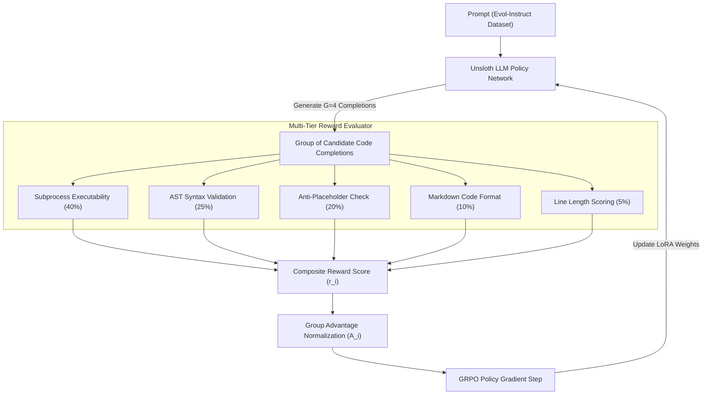

# GRPO Fine-Tuning for Python Code Generation

[](https://www.python.org/downloads/)
[](https://github.com/unslothai/unsloth)
[](https://github.com/huggingface/trl)
[](LICENSE)

An end-to-end, production-ready framework for fine-tuning Large Language Models (LLMs) on Python code generation tasks using **Group Relative Policy Optimization (GRPO)**, **Unsloth 4-bit QLoRA**, and Hugging Face's **TRL**.

This repository provides a complete RLHF pipeline designed to maximize code executability, syntax validity, and structural quality on resource-constrained hardware (e.g., NVIDIA T4 GPUs or single consumer GPUs).

---

## Table of Contents

- [Overview](#-overview)
- [Key Features](#-key-features)
- [Why GRPO?](#-why-grpo)
- [System Architecture](#-system-architecture)
- [Repository Structure](#-repository-structure)
- [Installation & Requirements](#-installation--requirements)
- [Quick Start](#-quick-start)
  - [1. Configuration](#1-configuration)
  - [2. Model Training](#2-model-training)
  - [3. Model Exporting](#3-model-exporting)
- [Multi-Objective Reward System](#-multi-objective-reward-system)
- [Validation & Early Stopping](#-validation--early-stopping)
- [Configuration Reference](#-configuration-reference)
- [License](#-license)

---

## 🛠 Overview

Reinforcement Learning from Human/Automated Feedback (RLHF) is essential for aligning general-purpose LLMs to technical domains like Python code synthesis. This project implements a **GRPO fine-tuning pipeline** using the `nickrosh/Evol-Instruct-Code-80k-v1` dataset.

By replacing traditional PPO value models with Group Relative Policy Optimization, this project optimizes memory overhead while assessing generated code via a **5-tier composite execution-based reward function**.

---

## Key Features

- **GRPO Alignment Algorithm**: Eliminates the Critic (Value) model required by PPO, significantly cutting VRAM usage and preventing training instability.
- **Unsloth & 4-bit QLoRA Acceleration**: High-performance, memory-efficient fine-tuning enabling training on single GPUs (e.g., Google Colab NVIDIA T4 16GB).
- **Subprocess Execution Sandbox**: Evaluates code executability dynamically using isolated subprocess calls protected by timeout safeguards (5 seconds default).
- **5-Tier Composite Reward System**: Combines dynamic execution success (40%), AST syntax validation (25%), anti-placeholder checks (20%), code block formatting (10%), and line length scoring (5%).
- **Validation Callback & Smart Early Stopping**: Tracks validation metrics (`val/mean_reward`, `val/pass_rate`, `val/syntax_rate`, `val/format_rate`) and automatically saves the best model checkpoint.
- **Centralized YAML Configuration**: Managed hyperparameters, reward weights, and training configurations in [configs/grpo_config.yaml](/LLM/Fine_Tuning/GRPO/configs/grpo_config.yaml).
- **Seamless Model Export**: Dedicated export utility ([scripts/export_model.py](/LLM/Fine_Tuning/GRPO/scripts/export_model.py)) for merging LoRA adapters into standalone 16-bit float models or GGUF formats.

---

## Why GRPO?

Standard PPO requires initializing and updating two large models simultaneously: the **Policy Network** and the **Value (Critic) Network**. GRPO (Group Relative Policy Optimization) removes the Critic model entirely by:

1. Generating a group of candidate completions $\{y_1, y_2, \dots, y_G\}$ for a given prompt $x$.
2. Computing scalar rewards $\{r_1, r_2, \dots, r_G\}$ for each candidate completion.
3. Calculating normalized group-relative advantages:
   $$A_i = \frac{r_i - \text{mean}(R)}{\text{std}(R) + \epsilon}$$
4. Updating policy weights using a PPO-style clipped objective using relative advantage without critic estimation.

| Aspect | PPO | GRPO |
| :--- | :---: | :---: |
| **Critic Model** | Required (High VRAM footprint) | **Not Required** (Low VRAM footprint) |
| **Baseline Metric** | Learned Value Function | **Group Mean Reward** |
| **Sample Efficiency** | Standard | **High** (Multi-response group scoring) |
| **Colab T4 Support** | Very Difficult / OOM | **Fully Supported** |

---

## System Architecture



---

## Repository Structure

```
GRPO/
├── configs/
│   ├── grpo_config.yaml            # Default configuration (Colab T4 / general settings)
│   ├── grpo_config_3090_vllm.yaml   # Hardware-optimized config for RTX 3090 + vLLM
│   ├── grpo_config_rtx2080ti.yaml   # Hardware-optimized config for RTX 2080 Ti
│   └── grpo_config_vllm.yaml        # Accelerated generation config using vLLM engine
├── logs/                           # Evaluation logs and training metric outputs
├── model/                          # Local base/SFT model weights directory
├── notebook/
│   └── Fine_Tuning_GRPO_Evol_Instruct_Code.ipynb # Jupyter notebook for interactive & Colab execution
├── scripts/
│   ├── train.py                    # Main pipeline training entrypoint
│   └── export_model.py             # Script to merge LoRA adapters into full models
├── src/
│   ├── callbacks/
│   │   ├── early_stopping.py       # CodeQualityCallback for evaluation & early stopping
│   │   └── metrics_logger.py       # TrainingMetricsLoggerCallback for real-time metric logging
│   ├── data/
│   │   └── dataset.py              # Dataset loading, filtering, and prompt formatting
│   ├── model/
│   │   └── loader.py               # Base model loading and QLoRA configuration
│   ├── rewards/
│   │   ├── code_rewards.py         # 5 component reward functions
│   │   └── combined.py             # Composite reward synthesis engine
│   └── training/
│       └── trainer.py              # GRPOConfig & GRPOTrainer initialization
├── .gitignore                      # Git ignore rules
├── requirements.txt                # Python dependency specifications
└── README.md                       # Technical documentation
```

---

## Installation & Requirements

### Prerequisites
- **Operating System**: Linux, WSL2, or Windows
- **Python**: 3.10 or higher
- **Hardware**: NVIDIA GPU with 16 GB+ VRAM (NVIDIA T4, RTX 3090/4090, A10G, or A100)

### Setup Instructions

1. **Clone the repository:**
   ```bash
   git clone https://github.com/TruongNVMM/LLM
   cd Fine-Tuning/GRPO
   ```
2. **Create virtual environment:**
   ```bash
   python3 -m venv .venv
   source .venv/bin/activate
   ```
3. **Install Unsloth & Dependencies:**
   ```bash
   pip install --no-deps unsloth unsloth_zoo
   pip install -r requirements.txt
   ```

*(Optional)* If operating on Linux/WSL2 with CUDA 11.8+, installing `vllm>=0.4.2` will enable faster generation during GRPO rollouts.

---

## Quick Start

### 1. Configuration

Update `configs/grpo_config.yaml` to set your target Supervised Fine-Tuned (SFT) model path:

```yaml
model:
  sft_model_dir: "./your_sft_model"
  max_seq_length: 2048
  load_in_4bit: true

training:
  per_device_train_batch_size: 4
  num_generations: 4
  learning_rate: 5.0e-6
```

### 2. Model Training

Launch training using the command line:

```bash
# Execute with default config
python scripts/train.py

# Execute with custom configuration or CLI overrides
python scripts/train.py \
  --config configs/grpo_config.yaml \
  --sft_model_dir /path/to/your/sft_model \
  --output_dir outputs_grpo
```

### 3. Model Exporting

Merge LoRA adapters into a full float16 model or save GGUF checkpoints:

```bash
python scripts/export_model.py \
  --best_model_dir best_grpo_checkpoint \
  --output_dir exported_model \
  --save_method merged_16bit
```

---

## Multi-Objective Reward System

Code generation quality is evaluated across 5 modular reward functions implemented in `src/rewards/`:

| Reward Function | Weight | Implementation | Evaluation Criteria |
| :--- | :---: | :--- | :--- |
| **Executability** | **40%** | `reward_code_executable` | Code runs cleanly in a Python subprocess within 5 seconds without raising exceptions. |
| **Syntax Validity** | **25%** | `reward_syntax_valid` | Code parses into a valid Python Abstract Syntax Tree (AST) using `ast.parse()`. |
| **Anti-Placeholder** | **20%** | `reward_no_placeholder` | Penalizes incomplete outputs containing `pass`, `TODO`, `FIXME`, or `NotImplementedError`. |
| **Formatting** | **10%** | `reward_code_format` | Requires completion to wrap code in markdown tags (` ```python ... ``` `). |
| **Length Quality** | **5%** | `reward_length_quality` | Rewards concise code blocks between 3 and 50 lines. |

---

## Validation & Early Stopping

During training, the custom callback `CodeQualityCallback` evaluates validation batches every `eval_steps` and records metrics to `logs/eval_metrics.log` and `grpo_training.log`:

- `val/pass_rate`: Percentage of samples passing execution.
- `val/syntax_rate`: Percentage of samples with valid AST syntax.
- `val/format_rate`: Percentage of samples adhering to Markdown formatting.
- `val/mean_reward`: Primary metric driving early stopping decisions.

Early stopping terminates training if `val/mean_reward` fails to improve by `min_delta` over `patience` consecutive evaluation checks.

---

## Configuration Reference

| Parameter Category | Key | Default Value | Description |
| :--- | :--- | :---: | :--- |
| **Model** | `sft_model_dir` | Required | Path to base SFT model checkpoint |
| | `load_in_4bit` | `true` | Enables 4-bit NormalFloat quantization |
| **LoRA** | `r` | `16` | LoRA rank dimension |
| | `lora_alpha` | `32` | LoRA scaling factor |
| **Training** | `num_generations` | `4` | Number of candidate completions per prompt |
| | `learning_rate` | `5.0e-6` | Conservative learning rate for RL fine-tuning |
| | `gradient_accumulation_steps` | `4` | Gradient accumulation steps |
| **Callback** | `eval_steps` | `4` | Step interval for validation evaluation |
| | `patience` | `3` | Patience step count before early stopping |

---

## Benchmark Results

| Benchmark | Pass@1 | Pass@5 | Pass@10 |
|-----------|--------|--------|--------|
| HumanEval | 0.82 | 0.85 | 0.91 |
| HumanEval+ | 0.7 | 0.75 | 0.8 |

---
## License

This project is released under the **MIT License**.
